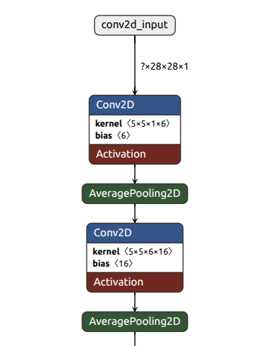
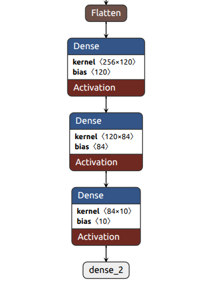
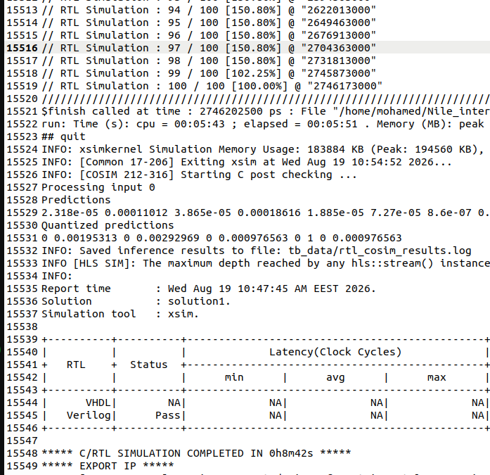
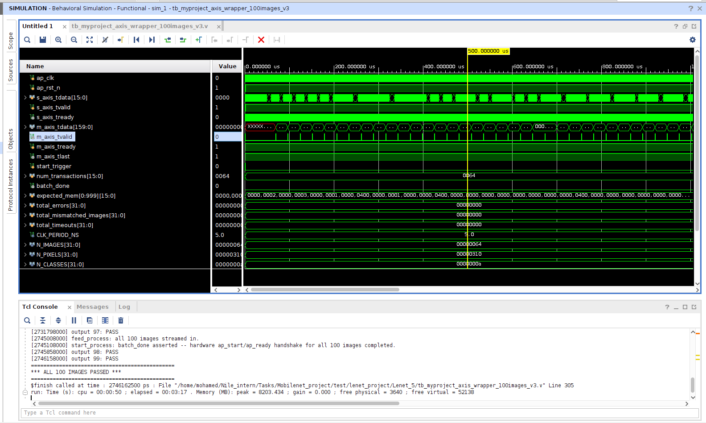
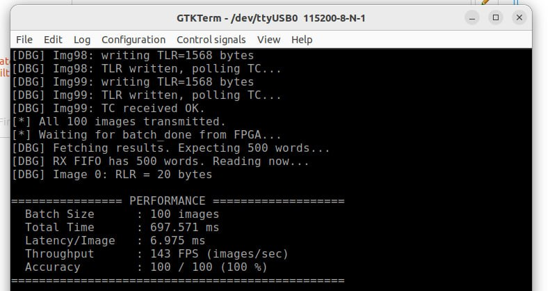

# Acceleration of LeNet-5 Model on ZCU102 Using hls4ml

## Framework Overview: hls4ml (v1.3.0)

**Theory:** hls4ml is an open-source compiler that translates trained neural network models from high-level frameworks (Keras, PyTorch, ONNX, QKeras) into synthesizable C/C++ High-Level Synthesis (HLS) projects.

**Motivation:** Manual FPGA hardware design in VHDL/Verilog requires significant time and hardware expertise. hls4ml automates optimized C++ HLS code generation, enabling rapid prototyping and hardware-software co-design.

## Key Features (Version 1.3.0)

- **Frontend Support:** Keras (v2, v3), QKeras (v2, v3), HGQ (v1, v2), PyTorch, ONNX, and QONNX.
- **Supported Architectures:** MLPs, 1D/2D CNNs, RNNs (LSTM, GRU), GarNet, Einsum/EinsumDense, and Multi-Head Attention (experimental).
- **HLS Backends:** Vivado HLS, Vitis HLS, Intel HLS, Catapult HLS, and oneAPI (experimental).

## Core Architecture & Optimization Concepts

### Pipelining & Execution

Layers are computed sequentially using pipelining (accepting new inputs after an Initiation Interval). Non-trivial activation functions are precomputed.

### Optimization Knobs

- **Precision & Fixed-Point:** Uses fixed-point arithmetic instead of floating-point to significantly boost speed and reduce resource usage.
- **Quantization-Aware Training (QAT):** Integrates seamlessly with tools like QKeras to maintain accuracy at low precision during inference.
- **Reuse Factor:** Controls how many times a single multiplier is reused per layer:
  - **Low Reuse Factor (e.g., 1):** Maximum parallelism, lowest latency, highest throughput, but higher resource usage.
  - **High Reuse Factor (e.g., 4):** Serialized computations, saving FPGA resources at the cost of higher latency.

  

### I/O Types

- **io_parallel:** Passes data in parallel across all elements. Ideal for MLPs and small CNNs seeking ultra-low latency.
- **io_stream:** Streams data pixel-by-pixel via FIFO buffers. Recommended for larger CNNs (like MobileNet) and RNNs to balance FPGA resource utilization (BRAM/LUTs). Includes FIFO depth optimization to prevent over-utilization.

### Implementation Strategy

Offers specialized matrix-vector multiplication routines (latency-oriented vs. resource-oriented) to match specific design trade-offs.

### Architecture

  

The hls4ml compiler infrastructure consists of four primary layers:

- **Front-End Parsers:** Parse model graphs, weights, and quantization specs into a unified IR.
- **Internal Representation (IR):** A model graph (ModelGraph) where nodes represent operators and edges represent tensor streams.
- **Optimizers:** Perform graph-level transformations, such as batch normalization fusion and line buffer insertion.
- **Back-Ends:** Map IR nodes into synthesizable C++ template implementations targeting vendors like Xilinx, Intel, or Siemens.

#### Implementation of Layers

Some layers, e.g., convolutional layers lowered to CMVM through the im2col transformation, may perform identical CMVM operations multiple times on different inputs in one forward pass. In this case, the parallelism between CMVM operations is controlled by the Parallelization Factor (PF).

  

Example CMVM in hls4ml with the Resource strategy: given a linear layer with N inputs, M outputs, and Reuse Factor RF, there will be P = (M × N) / RF multipliers operating in parallel. In each clock cycle, the control logic selects P out of the N inputs and feeds them to the multipliers, wrapping around if P > N. The N × M kernel is reshaped and mapped to on-chip memories such that P elements can be accessed in parallel each clock cycle. The products are accumulated accordingly at the specified precision to form the output.

**Activations:**

- Piecewise-linear activations (e.g., ReLU, Leaky ReLU) are implemented using multiplexers.
- Other activations (e.g., tanh, sigmoid) are implemented as lookup tables.

#### Implementation of I/O Types

  

Schematics of the computation of an MLP model implemented using parallel data transfer (left) and a CNN model implemented using streaming data transfer (right). In the Resource strategy, the number of parallel MAC operations executed in each cycle is determined by the RF and PF. In the case of the MLP, (M × N) / RF multiplications are executed in parallel each clock cycle.

## Implementation of LeNet-5

### hls4ml Workflow for LeNet-5

Validate the complete hls4ml deployment flow before moving to MobileNetV1. Use a lightweight CNN (LeNet-5) to debug the entire FPGA workflow. Verify that every stage works correctly:

  

### LeNet-5 Architecture
A LeNet-5 convolutional
neural network was implemented using TensorFlow and Keras
and trained on the MNIST handwritten-digit dataset. MNIST
contains 60,000 training images, 10,000 test images, and 10
classes corresponding to the digits 0–9.
The network processes 28 × 28 grayscale images and consists
of two convolutional layers, two average-pooling layers, and
three fully connected layers. The initial convolutional layer
applies six 5 × 5 filters, followed by ReLU activation and
average pooling. The next convolutional layer uses sixteen
5×5 filters, followed by ReLU activation and average pooling.
The resulting 4 × 4 × 16 feature map is flattened and passed
through fully connected layers containing 120 and 84 neurons,
respectively. The final layer consists of 10 neurons with a soft-
max activation to classify the 10 MNIST digit categories
<table>
  <tr>
    <td align="center"></td>
    <td align="center"></td>
  </tr>
</table>

### LeNet-5 Training

- **Dataset:** MNIST
- **Optimizer:** Adam
- **Loss:** Sparse Categorical Crossentropy
- **Epochs:** 5
- **Batch Size:** 128

#### Accuracy

  

### Model Compression Using TensorFlow Model Optimization Toolkit (TFMOT)

- **Purpose:** Reduce model size before FPGA implementation.
- **Technique:** Magnitude-based weight pruning, constant sparsity.
- **Configuration:**
  - Target Sparsity = 50%
  - Fine-tuning = 3 epochs

  

#### Accuracy

  

### Quantization-Aware Training (QAT)

- **Purpose:** Prepare the network for fixed-point FPGA inference while preserving accuracy.
- **Tool:** QKeras
- **Quantization:** QConv2D, QDense, Quantized ReLU, 8-bit weights, 8-bit biases.
- **Workflow:**
  1. Load the pruned model.
  2. Replace layers with QKeras layers.
  3. Copy pretrained weights.
  4. Fine-tune for 3 epochs.

#### Accuracy

  

### hls4ml Software Flow

Following model compression and quantization, the hls4ml configuration dictionary was specified to control the generated hardware architecture parameters. The following table details the layer-by-layer configuration parameters assigned in our design.

A Resource strategy was selected across all network layers to minimize overall FPGA resource consumption. Additionally, the io_stream interface type was chosen to handle the large 3D feature-map tensors (height, width, and channels) in the convolutional layers via sequential streaming with intermediate FIFOs.

<table style="width:100%; border-collapse: collapse; font-family: Arial, sans-serif; text-align: center;">
  <thead>
    <tr style="background-color: #2c3e50; color: #ffffff;">
      <th style="padding: 12px; border: 1px solid #dddddd;">Layer</th>
      <th style="padding: 12px; border: 1px solid #dddddd;">Weights</th>
      <th style="padding: 12px; border: 1px solid #dddddd;">RF</th>
      <th style="padding: 12px; border: 1px solid #dddddd;">Multipliers</th>
    </tr>
  </thead>
  <tbody>
    <tr style="background-color: #f9f9f9; color: #333333;">
      <td style="padding: 10px; border: 1px solid #dddddd;"><strong>Dense 1</strong></td>
      <td style="padding: 10px; border: 1px solid #dddddd;">30,720</td>
      <td style="padding: 10px; border: 1px solid #dddddd;">64</td>
      <td style="padding: 10px; border: 1px solid #dddddd;">480</td>
    </tr>
    <tr style="background-color: #ffffff; color: #333333;">
      <td style="padding: 10px; border: 1px solid #dddddd;"><strong>Dense 2</strong></td>
      <td style="padding: 10px; border: 1px solid #dddddd;">10,080</td>
      <td style="padding: 10px; border: 1px solid #dddddd;">90</td>
      <td style="padding: 10px; border: 1px solid #dddddd;">112</td>
    </tr>
    <tr style="background-color: #f9f9f9; color: #333333;">
      <td style="padding: 10px; border: 1px solid #dddddd;"><strong>Dense 3 (Output)</strong></td>
      <td style="padding: 10px; border: 1px solid #dddddd;">840</td>
      <td style="padding: 10px; border: 1px solid #dddddd;">1</td>
      <td style="padding: 10px; border: 1px solid #dddddd;">840</td>
    </tr>
  </tbody>
</table>

All remaining layers retained the default Reuse Factor of 1.

#### Model Conversion

Following configuration, the Keras model was converted into an hls4ml C++ project using the Vitis HLS backend, specifically targeting the Xilinx ZCU102 evaluation board (xczu9eg-ffvb1156-2-e).

#### HLS Synthesis, RTL Co-Simulation, and IP Export

The final step involved executing High-Level Synthesis via `hls_model.build()`. RTL co-simulation was performed using 100 MNIST test images to validate the cycle-accurate hardware logic against the C++ simulation output. The synthesized logic successfully classified all 100 images without errors. Subsequently, the finalized hardware design was synthesized and packaged as a custom Vitis IP core.

  

#### LeNet-5 Hardware Architecture Implementation

The following figure illustrates the hardware architecture generated by hls4ml for the first convolutional layer (Conv1) of the LeNet-5 model under the io_stream configuration.

  

Under the io_stream paradigm, input pixels enter the Conv1 layer sequentially as 16-bit fixed-point values (`ap_fixed<16,6>`). To execute a 5 × 5 spatial kernel across 6 output filters simultaneously in a single clock cycle, a 25-pixel sliding window must be presented concurrently to the compute engine. Shift line buffers accumulate the incoming streaming pixels and generate a parallel 25-pixel input vector (x1, x2, ..., x25) once a full receptive field is assembled.

The parallel Matrix-Vector Multiplication (MVM) block instantiates 150 multipliers (25 multipliers per filter × 6 filters). The resulting products are subsequently accumulated with the corresponding bias terms using a binary adder-tree structure, producing a 6-channel output vector (y1, y2, ..., y6).

> **Note:** The actual number of hardware multipliers will be reduced after synthesis, as Vitis HLS optimizers automatically eliminate the operations associated with the zero-valued weights resulting from our 50% pruning.

Furthermore, dense (fully-connected) layers are implemented using similar MVM arrays. Piecewise-linear activation functions, such as ReLU, are realized using hardware multiplexers (MUXes), whereas non-linear activation functions, such as Softmax, are implemented using look-up tables (LUTs).

The implemented architecture achieved an overall Initiation Interval (II) of 5,492 clock cycles.

Waveform analysis and simulation results in Vivado demonstrating the successful execution and validation of the exported IP:

  

### Vivado System Integration

  

Rather than using the generated IP from hls4ml, which requires manual control of its signals (such as `ap_start` and `ap_ready`) for every inference (image), we use a wrapper with an internal finite state machine (FSM) that automatically performs this handshake with the IP. This reduces overhead on the Processing System (PS); these signals are replaced in the wrapper with `start_trigger` and `num_transactions`, asserted to initiate an entire batch of data at once.

The system architecture we developed in Vivado and deployed on the FPGA is inspired by the hls4ml co-simulation, which depends on two FIFOs: one to stream data to the design and another to capture the result classification. To implement this, we searched for projects working with the same concept and found an FIR filter project on GitHub. The project relies on the AMD AXI4-Stream FIFO IP.

In our system, as shown in the previous figure, the Zynq processor writes the input-image pixels to the transmit (TX) FIFO, triggers the transfer, and reads the classification results from the RX FIFO.

However, the system presents several data-width challenges:

- The Zynq processor sends data to the TX FIFO through AXI4-Lite with a fixed width of 32 bits, whereas each image pixel is represented using 16 bits. Therefore, two pixels are packed into each 32-bit word. For an MNIST image (28 × 28 = 784 pixels), this requires 392 words per image.
- The RX FIFO depth is 512 words (160 × 100 / 32 = 500 words for 100 results), while the TX FIFO depth is 4,096 words.
- Our model's input data port is 16 bits as well, but the FIFO word and its output AXI4-Stream data port are 32 bits, so we use an intermediate AXI4-Stream Data Width Converter to convert from a 32-bit data stream to a 16-bit data stream.
- A similar problem exists on the output side: our model has an output data port of 160 bits (10 classes × 16 bits), and the RX FIFO has an input AXI4-Stream data port of 32 bits, so we use a second AXI4-Stream Data Width Converter (160-bit input, 32-bit output) between the model and the RX FIFO. As a result, the classification of one image is written in 5 words.

We use AXI GPIO blocks to allow the PS to control these signals: a dual-channel AXI GPIO for outputs (`start_trigger` and `num_transactions`) and a single-channel AXI GPIO for input (`batch_done`).

After integration, memory addresses are assigned for the RX FIFO, TX FIFO, GPIO1, and GPIO2 to allow the PS to communicate with the hardware.

Finally, the `.xsa` hardware-platform file was generated for use in Vitis. The following table summarizes the ZCU102 FPGA resource utilization of the complete system.

<table style="width:100%; border-collapse: collapse; font-family: Arial, sans-serif; text-align: center;">
  <thead>
    <tr style="background-color: #2c3e50; color: #ffffff;">
      <th style="padding: 12px; border: 1px solid #dddddd;">Resource</th>
      <th style="padding: 12px; border: 1px solid #dddddd;">Used</th>
      <th style="padding: 12px; border: 1px solid #dddddd;">Available</th>
      <th style="padding: 12px; border: 1px solid #dddddd;">Utilization (%)</th>
    </tr>
  </thead>
  <tbody>
    <tr style="background-color: #f9f9f9; color: #333333;">
      <td style="padding: 10px; border: 1px solid #dddddd;"><strong>LUTs</strong></td>
      <td style="padding: 10px; border: 1px solid #dddddd;">74,925</td>
      <td style="padding: 10px; border: 1px solid #dddddd;">274,080</td>
      <td style="padding: 10px; border: 1px solid #dddddd;">27.34%</td>
    </tr>
    <tr style="background-color: #ffffff; color: #333333;">
      <td style="padding: 10px; border: 1px solid #dddddd;"><strong>FFs</strong></td>
      <td style="padding: 10px; border: 1px solid #dddddd;">63,125</td>
      <td style="padding: 10px; border: 1px solid #dddddd;">548,160</td>
      <td style="padding: 10px; border: 1px solid #dddddd;">11.52%</td>
    </tr>
    <tr style="background-color: #f9f9f9; color: #333333;">
      <td style="padding: 10px; border: 1px solid #dddddd;"><strong>Block RAM (BRAM)</strong></td>
      <td style="padding: 10px; border: 1px solid #dddddd;">115</td>
      <td style="padding: 10px; border: 1px solid #dddddd;">912</td>
      <td style="padding: 10px; border: 1px solid #dddddd;">12.61%</td>
    </tr>
    <tr style="background-color: #ffffff; color: #333333;">
      <td style="padding: 10px; border: 1px solid #dddddd;"><strong>DSPs</strong></td>
      <td style="padding: 10px; border: 1px solid #dddddd;">1,750</td>
      <td style="padding: 10px; border: 1px solid #dddddd;">2,520</td>
      <td style="padding: 10px; border: 1px solid #dddddd;">69.44%</td>
    </tr>
    <tr style="background-color: #f9f9f9; color: #333333;">
      <td style="padding: 10px; border: 1px solid #dddddd;"><strong>CARRY8</strong></td>
      <td style="padding: 10px; border: 1px solid #dddddd;">8,342</td>
      <td style="padding: 10px; border: 1px solid #dddddd;">34,260</td>
      <td style="padding: 10px; border: 1px solid #dddddd;">24.35%</td>
    </tr>
  </tbody>
</table>

### Host Code in Vitis

Using the generated `.xsa` file from Vivado for the whole system, we developed the host code which runs on the Zynq processor (ARM Cortex-A53) to control the full system:

1. It asserts the `start_trigger` signal through GPIO to wake up the IP.
2. It reads the images from the `.hex` file image by image, packs two 16-bit pixels into a 32-bit word, and writes 392 words to the TX FIFO data port (FIFO TDFD).
3. It writes the size of the payload into the Transmit Length Register (FIFO TLR) and triggers the FIFO, waiting for the FIFO transmission to complete before processing the next image.
4. It waits for `batch_done` to be asserted by the model through GPIO.
5. It reads the 500 words from the data port (FIFO RDFD) and unpacks them back into 16-bit values.
6. Finally, it evaluates the performance metrics (accuracy, latency, and throughput).

During deployment on the ZCU102 board, after building both the Programmable Logic (PL) bitstream and the host application, the laptop was connected to the ZCU102 board via JTAG to program the FPGA and execute the host binary on the ARM Cortex-A53 processor. Additionally, a USB connection was used to display the performance metrics on the GTKTerm terminal app via the UART protocol.

Using an Integrated Logic Analyzer (ILA), which was synthesized into our system to monitor internal data flow, we found a bug during the initial hardware run where the weight files were not synthesized into BRAM. This caused the model output to always be zero, even though the input image pixels were being read correctly. After resolving this issue and generating an updated bitstream, the system operated correctly.

  

<table style="width:100%; border-collapse: collapse; font-family: Arial, sans-serif; text-align: center;">
  <thead>
    <tr style="background-color: #2c3e50; color: #ffffff;">
      <th style="padding: 12px; border: 1px solid #dddddd;">Implementation</th>
      <th style="padding: 12px; border: 1px solid #dddddd;">Platform</th>
      <th style="padding: 12px; border: 1px solid #dddddd;">Evaluation Data</th>
      <th style="padding: 12px; border: 1px solid #dddddd;">Accuracy</th>
      <th style="padding: 12px; border: 1px solid #dddddd;">Frequency</th>
      <th style="padding: 12px; border: 1px solid #dddddd;">Latency</th>
      <th style="padding: 12px; border: 1px solid #dddddd;">Throughput</th>
    </tr>
  </thead>
  <tbody>
    <tr style="background-color: #f9f9f9; color: #333333;">
      <td style="padding: 10px; border: 1px solid #dddddd;"><strong>hls4ml (this work)</strong></td>
      <td style="padding: 10px; border: 1px solid #dddddd;">ZCU102 FPGA</td>
      <td style="padding: 10px; border: 1px solid #dddddd;">100 images</td>
      <td style="padding: 10px; border: 1px solid #dddddd;"><strong>100.00%</strong></td>
      <td style="padding: 10px; border: 1px solid #dddddd;">100 MHz</td>
      <td style="padding: 10px; border: 1px solid #dddddd;">6.975 ms/image</td>
      <td style="padding: 10px; border: 1px solid #dddddd;">143 FPS</td>
    </tr>
  </tbody>
</table>

  

## CHALLENGES & LIMITATIONS
We used the Resource strategy because dense layers contain a large number of weights, which results in significant hardware resource utilization. Furthermore, if a Latency strategy were used, the C++ code would compile into a large number of instructions due to loop unrolling paradigms, leading to out-of-memory (OOM) errors on host PCs with limited memory.

Additionally, hls4ml supports the VivadoAccelerator backend, which allows using PYNQ software to easily deploy the design on the FPGA. It wraps the HLS IP with an AXI interface and generates a ready-to-use block design with the Zynq processor and DMA interface in Vivado. However, its limitation is that it relies on Vivado HLS, whereas newer versions of Vitis (such as 2023.1, bundled with Vivado 2023.1) utilize Vitis HLS instead of Vivado HLS. Therefore, using this backend requires an older version of Vivado (such as 2019 or 2020) or taking the manual approach, as done in this work, to generate the complete system. The hls4ml community is currently working on a VitisAccelerator backend similar to VivadoAccelerator that supports Vitis HLS, but it was not officially released at the time of this publication.
For the Vivado system integration in the hls4ml project, We
can replace the FIFOs with Direct Memory Access (DMA),
which allows the model to directly access the DDR memory
via AXI-Stream without needing the Zynq processor. We can
also replace the AXI GPIOs with AXI4-Lite by wrapping the
IP to have its own AXI4-Lite interface for direct control by
the PS. Furthermore, we can configure the Zynq processor to
communicate with the FIFOs using a full AXI4 interface rather
than AXI4-Lite. This would enable high-speed data bursts
rather than writing data word by word
For the Vivado system integration, the TX AXI4-Stream FIFO was configured with a depth of 4,096 words, but the host code sends a single image at a time (392 words), triggers the transfer, and waits for an acknowledgment that the model read the image before proceeding to the next image. This introduces software overhead on the PS for every image. Consequently, there are two potential approaches: if targeting area optimization, the FIFO depth can be reduced to 512 words to store one image at a time (which is also a valid approach when evaluating across the full dataset); conversely, if targeting throughput optimization, a FIFO depth of 39,200 words can be used for 100 images to accelerate data transfer.

## FUTURE WORK
For the Vivado system integration in the hls4ml project, we can replace the FIFOs with Direct Memory Access (DMA), which allows the model to directly access the DDR memory via AXI-Stream without needing the Zynq processor. We can also replace the AXI GPIOs with AXI4-Lite by wrapping the IP to have its own AXI4-Lite interface for direct control by the PS. Furthermore, we can configure the Zynq processor to communicate with the FIFOs using a full AXI4 interface rather than AXI4-Lite. This would enable high-speed data bursts rather than writing data word by word.

## References

1. J.-F. Schulte et al., **"hls4ml: A flexible, open source platform for deep learning acceleration on reconfigurable hardware,"** *ACM Transactions on Reconfigurable Technology and Systems*, vol. 19, no. 2, pp. 1–35, 2026.

2. T. Aarrestad et al., **"Fast convolutional neural networks on FPGAs with hls4ml,"** *Machine Learning: Science and Technology*, vol. 2, no. 4, p. 045015, 2021.

3. J. Duarte et al., **"Fast inference of deep neural networks in FPGAs for particle physics,"** *Journal of Instrumentation*, vol. 13, no. 07, p. P07027, 2018.

4. E. Floter et al., **"Real-time semantic segmentation on FPGAs for autonomous vehicles with hls4ml,"** *arXiv preprint arXiv:2104.06870*, 2021.

5. Fast Machine Learning Lab, **"hls4ml documentation."** [fastmachinelearning.org/hls4ml](https://fastmachinelearning.org/hls4ml/)

6. Google, **"QKeras: Deep learning quantization library for Keras."** [GitHub](https://github.com/google/qkeras)

7. TensorFlow, **"TensorFlow Model Optimization Toolkit: Pruning with Keras."** [TensorFlow Docs](https://www.tensorflow.org/model_optimization/guide/pruning/pruning_with_keras)

8. A. Fast et al., **"Neural Network Acceleration on MPSoC board: Integrating SLAC's SNL, Rogue Software and Auto-SNL,"** SLAC National Accelerator Laboratory Technical Report, 2023.

9. Fast Machine Learning Lab, **"hls4ml tutorial: QKeras CNN on SVHN."** [GitHub notebook](https://github.com/fastmachinelearning/hls4ml-tutorial/blob/main/4_advanced_models/4a_qkeras_cnn_svhn.ipynb)

10. Fast Machine Learning Lab, **"hls4ml tutorial: FPGA Bitstream Generation with PYNQ."** [GitHub notebook](https://github.com/fastmachinelearning/hls4ml-tutorial/blob/main/archived/part7a_bitstream.ipynb)

11. M. Tareq, **"Custom AXI IPs for DSP applications."** [GitHub](https://github.com/mohamedtareq24/DSP_Custom_AXI_IPs)

12. AMD Xilinx, **"AXI4-Stream FIFO v4.3 LogiCORE IP Product Guide (PG080),"** 2023. [Docs](https://docs.amd.com/r/en-US/pg080-axi-fifo-mm-s/Introduction)

13. AMD Xilinx, **"Zynq UltraScale+ Device Technical Reference Manual (UG1085),"** 2023. [Docs](https://docs.amd.com/v/u/en-US/ug1085-zynq-ultrascale-trm)

14. AMD Xilinx, **"Vitis Unified Software Development Platform Documentation (UG1393),"** 2023. [Docs](https://docs.amd.com/v/u/en-US/ug1393-vitis-application-acceleration)

15. AMD Xilinx, **"Vitis Tutorials Repository (v2023.1)."** [GitHub](https://github.com/Xilinx/Vitis-Tutorials/tree/2023.1)
