# Acceleration_of_Lenet_5_Model_on_ZCU102_Using_hls4ml
## Framework Overview: hls4ml (v1.3.0)
Theory: hls4ml is an open-source compiler that translates trained neural network models from high-level frameworks (Keras, PyTorch, ONNX, QKeras) into synthesizable C/C++ High-Level Synthesis (HLS) projects.
Motivation: Manual FPGA hardware design in VHDL/Verilog requires significant time and hardware expertise. hls4ml automates optimized C++ HLS code generation, enabling rapid prototyping and hardware-software co-design.

## Key Features (Version 1.3.0)
Frontend Support: Keras (v2, v3), QKeras (v2, v3), HGQ (v1, v2), PyTorch, ONNX, and QONNX.
Supported Architectures: MLPs, 1D/2D CNNs, RNNs (LSTM, GRU), GarNet, Einsum/EinsumDense, and Multi-Head Attention (experimental).
HLS Backends: Vivado HLS, Vitis HLS, Intel HLS, Catapult HLS, and oneAPI (experimental

## Core Architecture & Optimization Concepts
### Pipelining & Execution:
Layers are computed sequentially using pipelining (accepting new inputs after an Initiation Interval). Non-trivial activation functions are precomputed.
### Optimization Knobs:
  Precision & Fixed-Point: Uses fixed-point arithmetic instead of floating-point to significantly boost speed and reduce resource usage
  Quantization-Aware Training (QAT): Integrates seamlessly with tools like QKeras to maintain accuracy at low precision during inference.
  Reuse Factor: Controls how many times a single multiplier is reused per layer:
  

  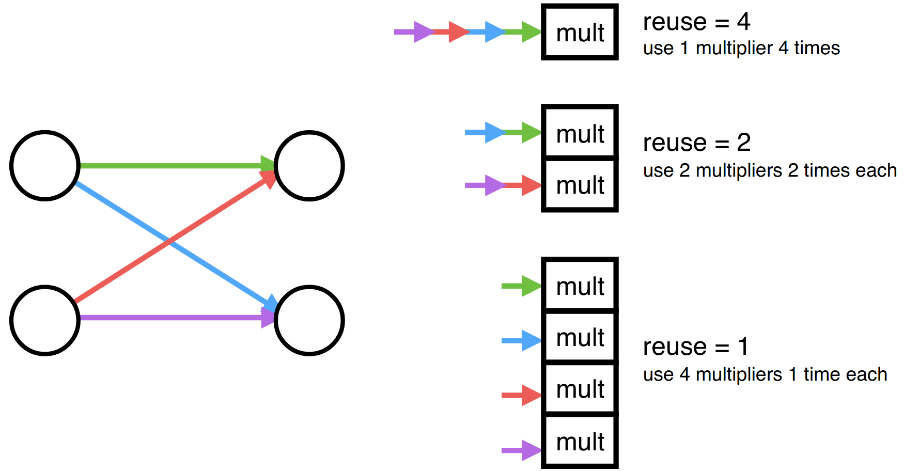

    Low Reuse Factor (e.g., 1): Maximum parallelism, lowest latency, highest throughput, but higher resource usage.
    High Reuse Factor (e.g., 4): Serialized computations, saves FPGA resources at the cost of higher latency.
    
### I/O Types:
  io_parallel: Passes data in parallel across all elements. Ideal for MLPs and small CNNs seeking ultra-low latency
  io_stream: Streams data pixel-by-pixel via FIFO buffers. Recommended for larger CNNs (like MobileNet) and RNNs to balance FPGA resource utilization (BRAM/LUTs). Includes FIFO depth optimization to prevent over-utilization.
### Implementation Strategy:
 Offers specialized matrix-vector multiplication routines (latency-oriented vs. resource-oriented) to match specific design trade-offs.

### Architecture
  

  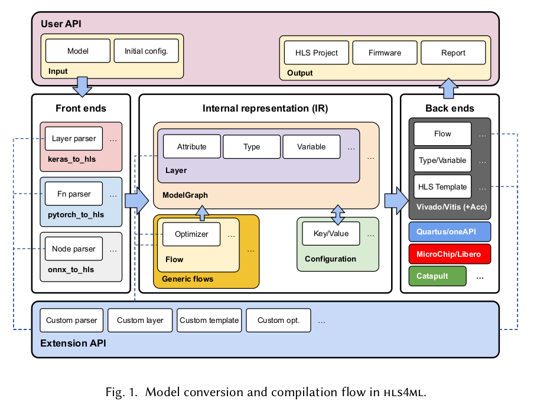

#### The hls4ml compiler infrastructure consists of four primary layers:
  Front-End Parsers: Parse model graphs, weights, and quantization specs into a unified IR.
  Internal Representation (IR): A model graph (ModelGraph) where nodes represent operators and edges represent tensor streams.
  Optimizers: Perform graph-level transformations, such as batch normalization fusion and line buffer insertion.
  Back-Ends: Map IR nodes into synthesizable C++ template implementations targeting vendors like Xilinx, Intel, or Siemens.
#### Implementation of layers
Some layers, e.g., convolutional layers lowered to CMVM through the im2col [21] transformation, may perform identical CMVM operations multiple times on different inputs in one forward pass. In this case, the parallelism between CMVM operations is controlled by the Parallelization Factor (PF).
  

  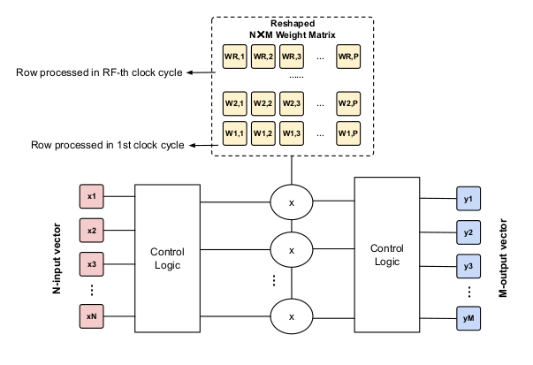

Example CMVM in hls4ml with the Resource strategy. Given a linear layer with 𝑁 N inputs, M𝑀 outputs and reuse factor RF, there will be 𝑃P = 𝑀(M*N𝑁)/Rf multipliers operating in parallel. In each clock cycle, the control logic selects 𝑃P out of the N𝑁 inputs and feeds them to the multipliers, with wrap around if P 𝑃 > 𝑁 N The N𝑁 ×M 𝑀 kernel is reshaped and mapped to on-chip memories such that 𝑃 elements can be accessed in parallel in each clock cycle. The products are accumulated accordingly at the precision specified to form the output.
Activations: Piecewise linear activations (e.g., ReLU, Leaky ReLU) are implemented using multiplexers. Other activa- tions (e.g., tanh, sigmoid) are implemented as lookup tables

#### Implementation of IO-types
  

  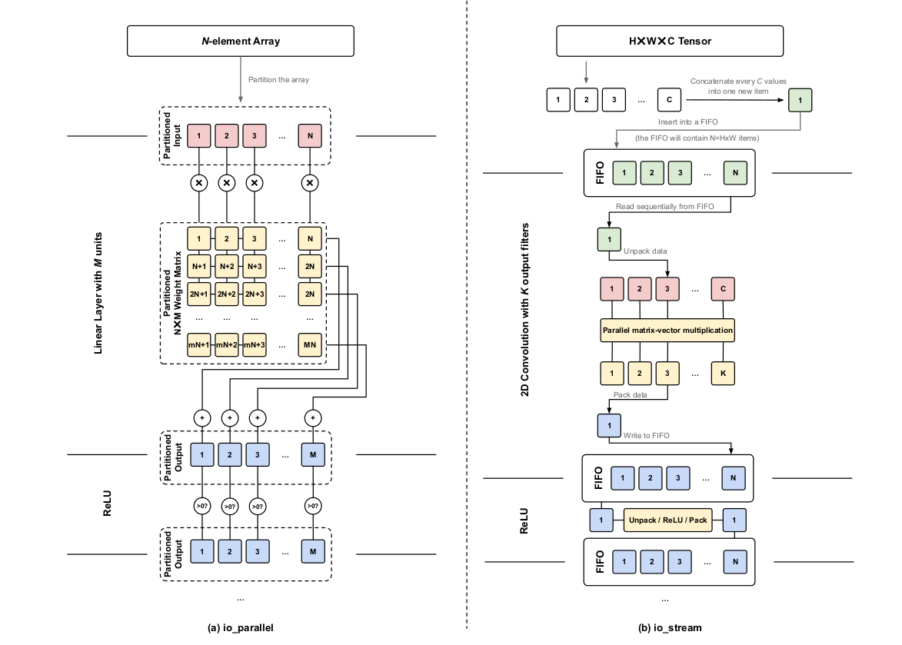

Schematics of the computation of an MLP model implemented using parallel data transfer (left) and a CNN model implemented using streaming data transfer (right). In the Resource strategy, the number of parallel MAC operations executed in each cycle is determined by the RF and PF. In the case of the MLP, (𝑀M*N)/RF multiplications are executed in parallel each clock cycle.

## implementation of LeNet-5 

### hls4ml workflow for LeNet-5
Validate the complete hls4ml deployment flow before moving to MobileNetV1.Use a lightweight CNN (LeNet-5) to debug the entire FPGA workflow.Verify that every stage works correctly:

  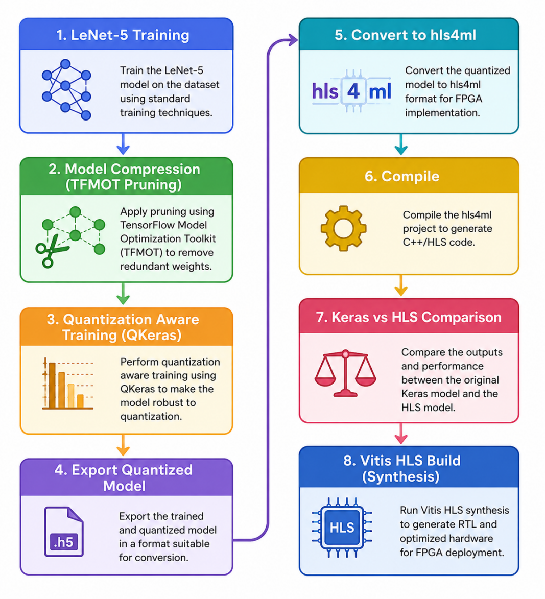

### LeNet-5 Architecture

<table>
  <tr>
    <td align="center"></td>
    <td align="center"></td>
  </tr>
</table>

### LeNet-5 Training
  Dataset: MNIST
  Optimizer: Adam
  Loss: Sparse Categorical Crossentropy
  Epochs: 5
  Batch Size: 128
#### Accuracy

  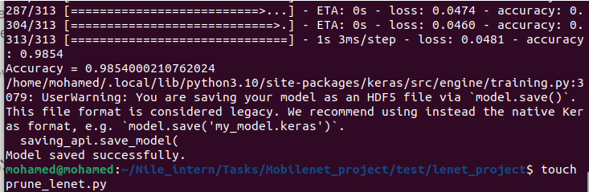

### Model Compression using TensorFlow Model Optimization Toolkit (TFMOT)
  Purpose :Reduce model size before FPGA implementation.
  Technique: Magnitude-based Weight Pruning Constant Sparsity
  Configuration
    Target Sparsity = 50%
    Fine-tuning = 3 epochs

  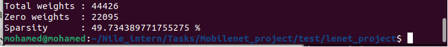

#### Accuracy

  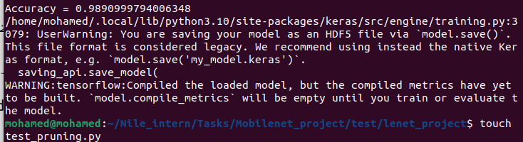

### Quantization Aware Training (QAT)
  Purpose : Prepare the network for fixed-point FPGA inference while preserving 	accuracy.
  Tool : QKeras
  Quantization :QConv2D ,QDense ,Quantized ReLU,8-bit Weights ,8-bit Biases
  Workflow
    Load pruned model
    Replace layers with QKeras layers
    Copy pretrained weights
    Fine-tune for 3 epochs
#### Accuracy

  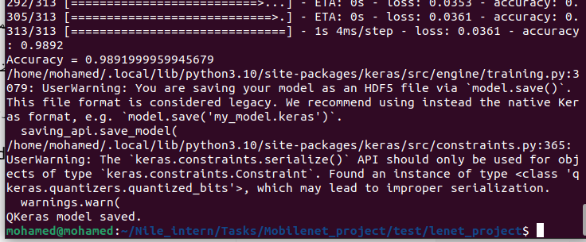

### hls4ml Software Flow: 
Following model compression and quantization, the hls4ml configuration dictionary was specified
to control the generated hardware architecture parameters.
following Table details the layer-by-layer configuration parameters
assigned in our design.
A Resource strategy was selected across all network layers to
minimize overall FPGA resource consumption. Additionally,
the io stream interface type was chosen to handle the large 3D
feature map tensors (height, width, and channels) in the con-
volutional layers via sequential streaming with intermediate
FIFO
<table style="width:100%; border-collapse: collapse; font-family: Arial, sans-serif; text-align: center;">
  <thead>
    <tr style="background-color: #2c3e50; color: #ffffff;">
      <th style="padding: 12px; border: 1px solid #dddddd;">Layer</th>
      <th style="padding: 12px; border: 1px solid #dddddd;">Weights</th>
      <th style="padding: 12px; border: 1px solid #dddddd;">RF</th>
      <th style="padding: 12px; border: 1px solid #dddddd;">Multipliers</th>
    </tr>
  </thead>
  <tbody>
    <tr style="background-color: #f9f9f9; color: #333333;">
      <td style="padding: 10px; border: 1px solid #dddddd;"><strong>Dense 1</strong></td>
      <td style="padding: 10px; border: 1px solid #dddddd;">30,720</td>
      <td style="padding: 10px; border: 1px solid #dddddd;">64</td>
      <td style="padding: 10px; border: 1px solid #dddddd;">480</td>
    </tr>
    <tr style="background-color: #ffffff; color: #333333;">
      <td style="padding: 10px; border: 1px solid #dddddd;"><strong>Dense 2</strong></td>
      <td style="padding: 10px; border: 1px solid #dddddd;">10,080</td>
      <td style="padding: 10px; border: 1px solid #dddddd;">90</td>
      <td style="padding: 10px; border: 1px solid #dddddd;">112</td>
    </tr>
    <tr style="background-color: #f9f9f9; color: #333333;">
      <td style="padding: 10px; border: 1px solid #dddddd;"><strong>Dense 3 (Output)</strong></td>
      <td style="padding: 10px; border: 1px solid #dddddd;">840</td>
      <td style="padding: 10px; border: 1px solid #dddddd;">1</td>
      <td style="padding: 10px; border: 1px solid #dddddd;">840</td>
    </tr>
  </tbody>
</table>
All remaining layers retained the default Reuse Factor of 1.

#### Model Conversion: Following configuration, the Keras
model was converted into an hls4ml C++ project using the
Vitis HLS backend, specifically targeting the Xilinx ZCU102
evaluation board (xczu9eg-ffvb1156-2-e).
#### HLS Synthesis, RTL Co-Simulation, and IP Export:
The final step involved executing High-Level Synthesis via
hls_model.build(). RTL co-simulation was performed
using 100 MNIST test images to validate the cycle-accurate
hardware logic against the C++ simulation output. The syn-
thesized logic successfully classified all 100 images without
errors. Subsequently, the finalized hardware design was syn-
thesized and packaged as a custom Vitis IP core.
#### LeNet-5 Hardware Architecture Implementation: 
following Figure illustrates the hardware architecture generated by hls4ml for
the first convolutional layer (Conv1) of the LeNet-5 model
under the io stream configuration.

  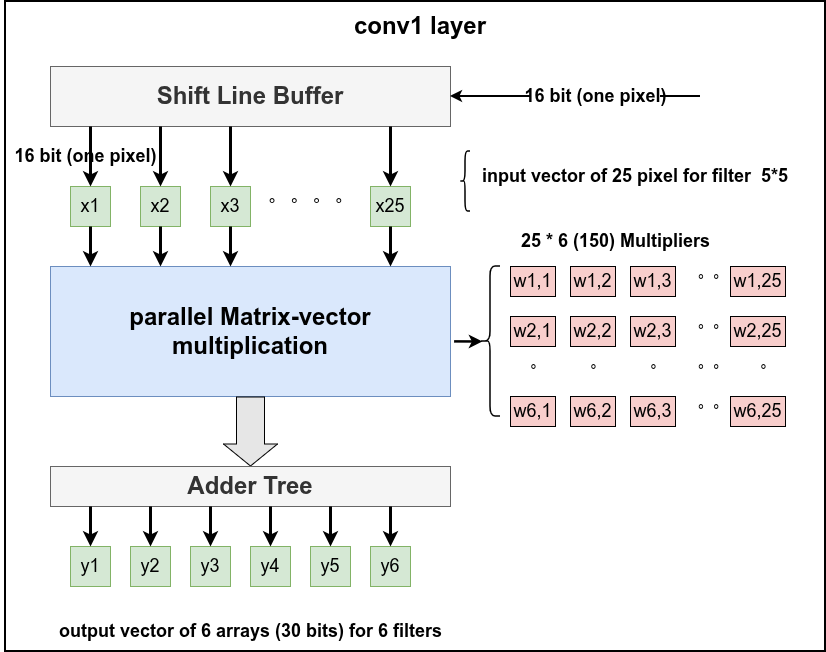

Under the io stream paradigm, input pixels enter the Conv1
layer sequentially as 16-bit fixed-point (ap fixed¡16, 6]¿).
To execute a 5 × 5 spatial kernel across 6 output filters
simultaneously in a single clock cycle, a 25-pixel sliding
window must be presented concurrently to the compute engine.
Shift line buffers accumulate the incoming streaming pixels
and generate a parallel 25-pixel input vector (x1, x2, . . . , x25)
once a full receptive field is assembled.
The parallel Matrix-Vector Multiplication (MVM) block in-
stantiates 150 multipliers (25 multipliers per filter × 6 filters).
The resulting products are subsequently accumulated with the
corresponding bias terms using a binary Adder Tree structure,
producing a 6-channel output vector (y1, y2, . . . , y6).
Note: The actual number of hardware multipliers will be
reduced after synthesis, as Vitis HLS optimizers automati-
cally eliminate the operations associated with the zero-valued
weights resulting from our 50
Furthermore, dense (fully-connected) layers are implemented
using similar MVM arrays. Piecewise-linear activation func-
tions, such as ReLU, are realized using hardware multiplexers
(MUXes), whereas non-linear activation functions, such as
Softmax, are implemented using Look-Up Tables (LUTs).
The implemented architecture achieved an overall Initiation
Interval (II) of 5492 clock cycles.

### Vivado System Integration:

  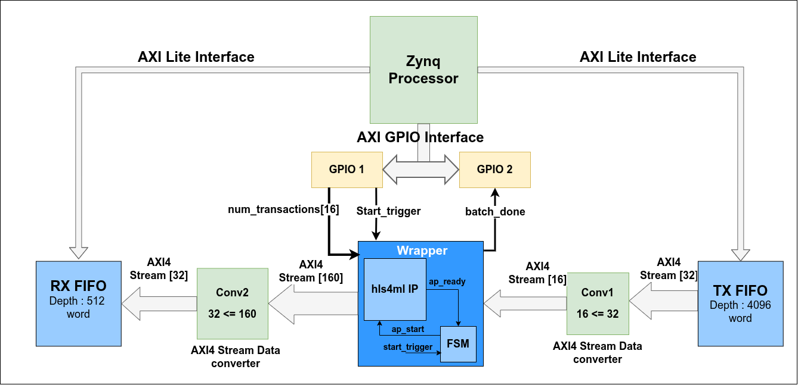

Rather than using the generated IP of hls4ml, which requires
manual control of its signals such as ap start and ap ready
for every inference (image), we use a wrapper which has an
internal finite state machine (FSM) that automatically does
this handshake with the IP. This reduces overhead on the
Processing System (PS), and these signals are replaced in the
wrapper with start trigger and num transactions, asserted to
initiate an entire batch of data at once.
The system architecture we developed in Vivado and deployed
on the FPGA is inspired by the hls4ml co-simulation, which
depends on 2 FIFOs: one to stream data to the design and
another to capture the result classification. To implement this,
we searched for projects working with the same concept and
we finally found an FIR filter project on GitHub. The
project system relies on the AMD AXI4-Stream FIFO IP.
In our system, the Zynq processor , as shown in privious Figure,
writes the input-image pixels to the transmit (TX) FIFO,
triggers the transfer, and reads the classification results from
the RX FIFO. However, the system presents several data-width
challenges: the Zynq processor sends data to the TX FIFO
through AXI4-Lite with a fixed width of 32 bits, whereas
each image pixel is represented using 16 bits. Therefore, two
pixels are packed into each 32-bit word. For an MNIST image
(28 × 28 = 784 pixels), this requires 392 words per image.
The RX FIFO depth is 512 words (160×100/32 = 500 words
for 100 results), while the TX FIFO depth is 4096 words. 
Our model input data port is 16 bits as well, but the FIFO word
and its output AXI4-Stream data port are 32 bits, so we need
an intermediate block to convert from a 32-bit data stream to
a 16-bit data stream. Therefore, we use an AXI4-Stream Data
Width Converter between the FIFO and the model. A similar
problem exists for the output: our model has an output data
port of 160 bits width (10 classes × 16 bits) and the RX FIFO
has an input AXI4-Stream data port of 32 bits, so we use a
second AXI4-Stream Data Width Converter with an input of
160 bits and an output of 32 bits between the model and the
RX FIFO, so the classification of one image is written in 5
words.
we use AXI GPIO blocks to allow the PS to control these
signals by using a dual-channel AXI GPIO for outputs
(start trigger and num transactions) and a single-channel AXI
GPIO for input (batch done).
After integration, there are memory addresses assigned for the
RX FIFO, TX FIFO, GPIO1, and GPIO2 to allow the PS to
communicate with the hardware.
Finally, the .xsa hardware-platform file was generated for
use in Vitis. following Table summarizes the ZCU102 FPGA resource
utilization of the complete system

<table style="width:100%; border-collapse: collapse; font-family: Arial, sans-serif; text-align: center;">
  <thead>
    <tr style="background-color: #2c3e50; color: #ffffff;">
      <th style="padding: 12px; border: 1px solid #dddddd;">Resource</th>
      <th style="padding: 12px; border: 1px solid #dddddd;">Used</th>
      <th style="padding: 12px; border: 1px solid #dddddd;">Available</th>
      <th style="padding: 12px; border: 1px solid #dddddd;">Utilization (%)</th>
    </tr>
  </thead>
  <tbody>
    <tr style="background-color: #f9f9f9; color: #333333;">
      <td style="padding: 10px; border: 1px solid #dddddd;"><strong>LUTs</strong></td>
      <td style="padding: 10px; border: 1px solid #dddddd;">74,925</td>
      <td style="padding: 10px; border: 1px solid #dddddd;">274,080</td>
      <td style="padding: 10px; border: 1px solid #dddddd;">27.34%</td>
    </tr>
    <tr style="background-color: #ffffff; color: #333333;">
      <td style="padding: 10px; border: 1px solid #dddddd;"><strong>FFs</strong></td>
      <td style="padding: 10px; border: 1px solid #dddddd;">63,125</td>
      <td style="padding: 10px; border: 1px solid #dddddd;">548,160</td>
      <td style="padding: 10px; border: 1px solid #dddddd;">11.52%</td>
    </tr>
    <tr style="background-color: #f9f9f9; color: #333333;">
      <td style="padding: 10px; border: 1px solid #dddddd;"><strong>Block RAM (BRAM)</strong></td>
      <td style="padding: 10px; border: 1px solid #dddddd;">115</td>
      <td style="padding: 10px; border: 1px solid #dddddd;">912</td>
      <td style="padding: 10px; border: 1px solid #dddddd;">12.61%</td>
    </tr>
    <tr style="background-color: #ffffff; color: #333333;">
      <td style="padding: 10px; border: 1px solid #dddddd;"><strong>DSPs</strong></td>
      <td style="padding: 10px; border: 1px solid #dddddd;">1,750</td>
      <td style="padding: 10px; border: 1px solid #dddddd;">2,520</td>
      <td style="padding: 10px; border: 1px solid #dddddd;">69.44%</td>
    </tr>
    <tr style="background-color: #f9f9f9; color: #333333;">
      <td style="padding: 10px; border: 1px solid #dddddd;"><strong>CARRY8</strong></td>
      <td style="padding: 10px; border: 1px solid #dddddd;">8,342</td>
      <td style="padding: 10px; border: 1px solid #dddddd;">34,260</td>
      <td style="padding: 10px; border: 1px solid #dddddd;">24.35%</td>
    </tr>
  </tbody>
</table>

### Host Code in Vitis:
Using the generated .xsa file from Vivado for the whole
system, we developed the host code [20], [21] which runs
on the Zynq processor (ARM Cortex-A53) to control the full
system.
First, it asserts the start trigger signal through GPIO to wake
up the IP. Then, it reads the images from the .hex file image
by image, packs two 16-bit pixels into a 32-bit word, and
writes 392 words to the TX FIFO data port (FIFO TDFD) It writes the size of the payload into the Transmit Length
Register (FIFO TLR) and triggers the FIFO, waiting for the
FIFO transmission to complete before processing the second
image. Next, it waits for batch done to be asserted by the
model through GPIO. Then, it reads the 500 words from the
data port (FIFO RDFD) and unpacks them back into 16-bit
values. Finally, it evaluates the performance metrics (accuracy,
latency, and throughput).
During the deployment on the ZCU102 board, after building
both the Programmable Logic (PL) bitstream and the host
application, the laptop was connected to the ZCU102 board via
JTAG to program the FPGA and execute the host binary on the
ARM Cortex-A53 processor. Additionally, a USB connection
was used to display the performance metrics on the GTKTerm
terminal app via the UART protocol.
Using an Integrated Logic Analyzer (ILA), which was syn-
thesized into our system to monitor internal data flow, helped
us during the initial hardware run to find a bug where the
weight files were not synthesized into BRAM. This caused the
model output to always be zero, even though the input image
pixels were being read correctly. After resolving this issue and
generating an updated bitstream, the system operated correctly.
<table style="width:100%; border-collapse: collapse; font-family: Arial, sans-serif; text-align: center;">
  <thead>
    <tr style="background-color: #2c3e50; color: #ffffff;">
      <th style="padding: 12px; border: 1px solid #dddddd;">Implementation</th>
      <th style="padding: 12px; border: 1px solid #dddddd;">Platform</th>
      <th style="padding: 12px; border: 1px solid #dddddd;">Evaluation Data</th>
      <th style="padding: 12px; border: 1px solid #dddddd;">Accuracy</th>
      <th style="padding: 12px; border: 1px solid #dddddd;">Frequency</th>
      <th style="padding: 12px; border: 1px solid #dddddd;">Latency</th>
      <th style="padding: 12px; border: 1px solid #dddddd;">Throughput</th>
    </tr>
  </thead>
  <tbody>
    <tr style="background-color: #f9f9f9; color: #333333;">
      <td style="padding: 10px; border: 1px solid #dddddd;"><strong>hls4ml (this work)</strong></td>
      <td style="padding: 10px; border: 1px solid #dddddd;">ZCU102 FPGA</td>
      <td style="padding: 10px; border: 1px solid #dddddd;">100 images</td>
      <td style="padding: 10px; border: 1px solid #dddddd;"><strong>100.00%</strong></td>
      <td style="padding: 10px; border: 1px solid #dddddd;">100 MHz</td>
      <td style="padding: 10px; border: 1px solid #dddddd;">6.975 ms/image</td>
      <td style="padding: 10px; border: 1px solid #dddddd;">143 FPS</td>
    </tr>
  </tbody>
</table>

  

